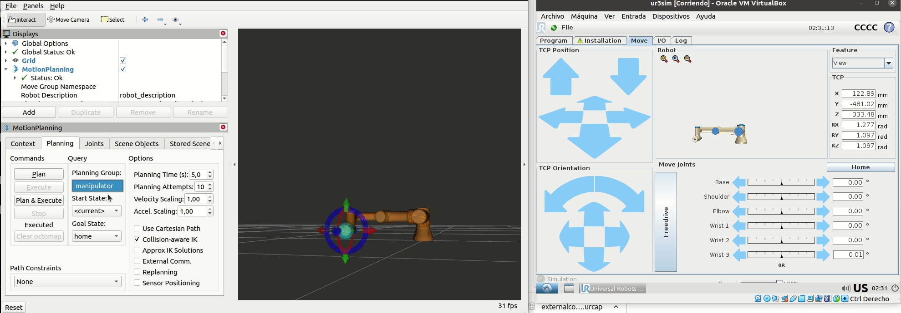
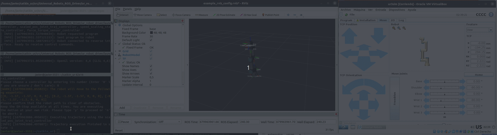

# Install URSIM in ubuntu 2004

Download  URSIM from [here](https://www.universal-robots.com/download/software-cb-series/simulator-linux/offline-simulator-cb3-linux-ursim-3158/) to install in ubuntu.

But, installing URSim in ubuntu, according to [here](https://forum.universal-robots.com/t/offline-simulator-e-series-ur-sim-for-linux-5-11-1-removes-all-installed-files/15384), breaks the ROS installation. Then, install the simulator URSim first, and then install ROS, at least for for the e-version.  It should be checked this condition happens with the CB version.

see [1](https://github.com/arunavanag591/ursim), [2](https://www.mathworks.com/help/supportpkg/urseries/ug/setup-ursim-offline-simulator.html) step by step how to install URSim.

Instead we install VM.

# Install virtual Box 

Download the virtual machine, [UR Vrs.E](https://www.universal-robots.com/download/software-e-series/simulator-non-linux/offline-simulator-e-series-ur-sim-for-non-linux-594/), [UR Vrs.CB](https://www.universal-robots.com/download/software-cb-series/simulator-non-linux/offline-simulator-cb-series-non-linux-ursim-3158/). See [doc](https://academy.universal-robots.com/media/r3xlna5e/ursim_vmoracle_installation_guide_v3_es.pdf) 

```
7z x URSim_VIRTUAL-3.14.3.1031232.rar -o/path/to/folder/to/extract
```

Open VM (Virtual machine) with Vbox and configure the network.

## Config the network in Vbox

Configure the  network as __Host-only Adapter (Adaptador sólo-anfitrión)__ in the VM.

# How to use URSim (in the VM) and ROS

See [this doc](https://github.com/UniversalRobots/Universal_Robots_ROS_Driver/blob/master/ur_robot_driver/doc/usage_example.md)

Run the VM and open URSim with UR3.

```
roslaunch ur_robot_driver ur3_bringup.launch robot_ip:=192.168.56.102

roslaunch ur_robot_driver example_rviz.launch
```


# Use moveit! [repo](https://github.com/jcorredorc/ur_haptics_teleop_ros)

<!-- [ref1](https://youtu.be/ayp87SjrwPc) -->


Download [URCap external control](https://github.com/UniversalRobots/Universal_Robots_ExternalControl_URCap/releases) to use Moveit!. Copy the urcap external control to the Vbox.


```
scp /home/user/externalcontrol-1.0.5.urcap  ur@192.168.56.102:/home/ur/ursim-current/programs
```


Then [follow the instructions](https://github.com/UniversalRobots/Universal_Robots_ROS_Driver/blob/master/ur_robot_driver/doc/install_urcap_cb3.md) to install and configure it.

Then run moveit!

```
roslaunch ur3_moveit_config moveit_planning_execution.launch

roslaunch ur3_moveit_config moveit_rviz.launch

```

Planning with Rviz. 




<!-- sale el error


```
...

[ INFO] [1678904220.911134129]: Execution request received
[ WARN] [1678904220.919861759]: Controller 'scaled_pos_joint_traj_controller' failed with error INVALID_GOAL: 
[ WARN] [1678904220.919935262]: Controller handle scaled_pos_joint_traj_controller reports status FAILED
[ INFO] [1678904220.919964724]: Completed trajectory execution with status FAILED ...
[ INFO] [1678904220.920016774]: Execution completed: FAILED

...

```

[ver](https://github.com/UniversalRobots/Universal_Robots_ROS_Driver/issues/55) En el paquete universal_robot/ur*_moveit_config/config/controllers.yaml, cambiar la linea 

```
action_ns: follow_joint_trajectory
```

a


```
action_ns: scaled_pos_traj_controller/follow_joint_trajectory

``` -->

-----

# Control the robot using the test_move script

Once URCaps external control is installed,

```
roslaunch ur_robot_driver example_rviz.launch

rosrun ur_robot_driver test_move
```





See the *test_move* code [here](https://github.com/UniversalRobots/Universal_Robots_ROS_Driver/blob/395c0541b20d0da2cd480e2ad85b2100410fb043/ur_robot_driver/scripts/test_move).

<!-- Get the error

```
[ERROR] [1679953069.855385572]: A controller named 'scaled_vel_joint_traj_controller' was already loaded inside the controller manager
[ERROR] [1679953069.856487405]: Robot control is currently inactive. Starting controllers that claim resources is currently not possible. Not starting controller 'scaled_vel_joint_traj_controller'
[ERROR] [1679953069.856515156]: Could not switch controllers. The hardware interface combination for the requested controllers is unfeasible.
[ERROR] [1679953071.592390894]: Can't accept new action goals. Controller is not running.
```

see [this](https://github.com/UniversalRobots/Universal_Robots_ROS_Driver/issues/480#issuecomment-934506448), [this](https://github.com/UniversalRobots/Universal_Robots_ROS_Driver/issues/380#issuecomment-844124263), [this](https://github.com/UniversalRobots/Universal_Robots_ROS_Driver/blob/master/ur_robot_driver/README.md)


try to install

```
sudo apt install ros-noetic-scaled-controllers

catkin build
```

Keeps the same problem, 


PArece que lo unico es instalar URcaps, para poder controlar el robot desde ROS. La pregunta es si esto se puede hacer en URSim?? porque la Vbox no deja montar una USB!


Ok solved the issue! :D -->


## Moveit! examples from [ur_haptics_teleop_ros](https://github.com/jcorredorc/ur_haptics_teleop_ros.git)

URSim working with the __move_group__

clone the repo

```
git clone  https://github.com/jcorredorc/ur_haptics_teleop_ros.git
```

Open URSim and run a program with external_control.

```
roslaunch ur3_moveit_config moveit_planning_execution.launch

roslaunch ur3_moveit_config moveit_rviz.launch

```

then 

```
rosrun ur_haptics_teleop_ros move_group_pose_goal_node
```


## URSIM for UrCaps development

see [here](https://www.universal-robots.com/articles/ur/urplus-resources/urcap-how-to-install-ursim-for-urcaps-development/)


## URSIM and Matlab

see Matlab [doc1](https://www.mathworks.com/help/supportpkg/urseries/ug/setup-ursim-offline-simulator.html)[doc2](https://github.com/mathworks/MATLAB-URCap-for-External-Control)
